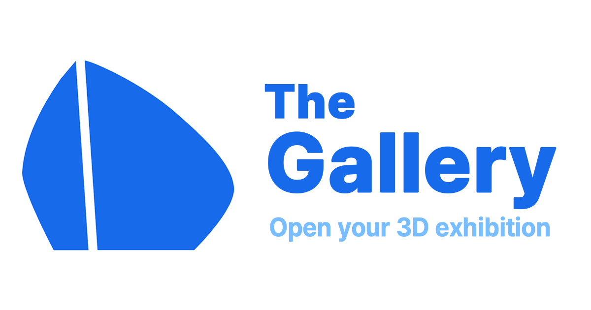
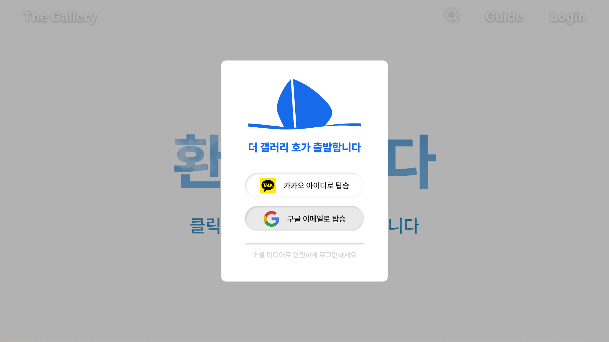
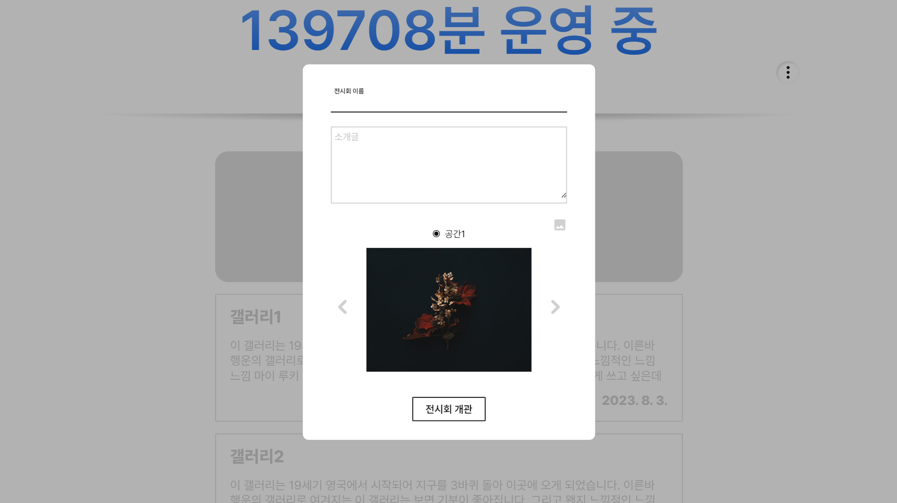
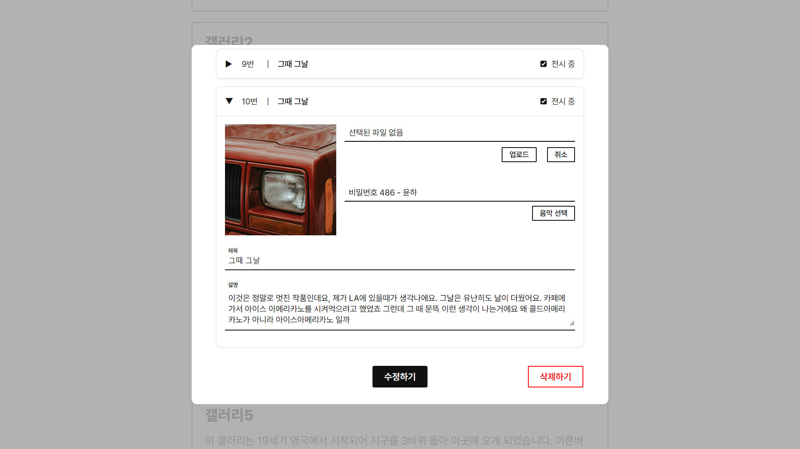
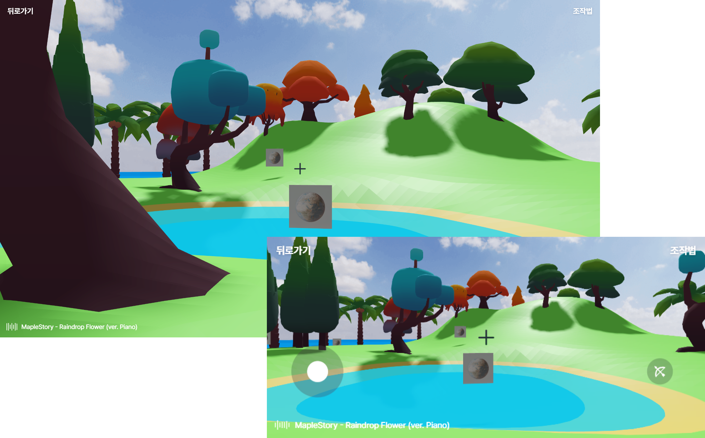
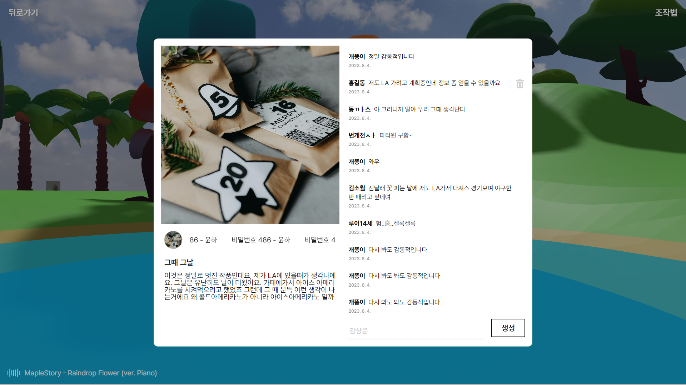
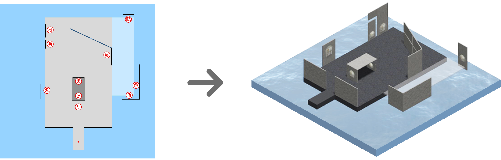
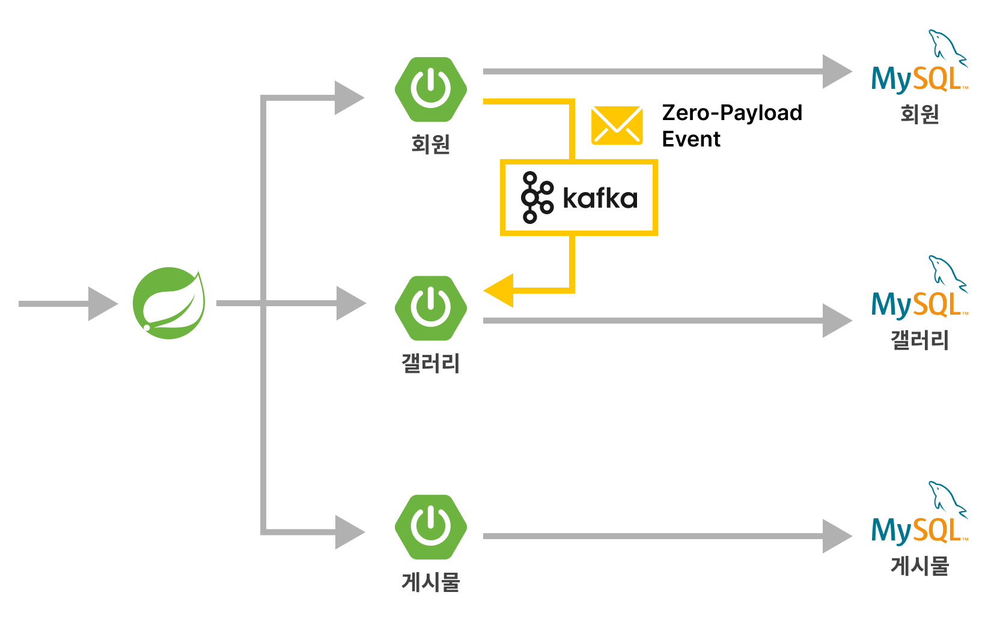
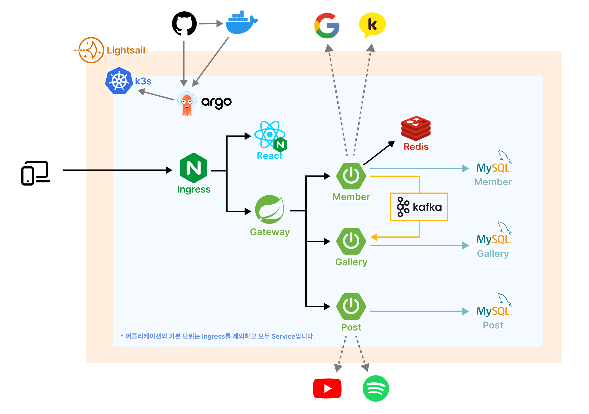

# The Gallery

<div align="center">
   
</div>

더 갤러리는 3D 소셜 네트워크 서비스(SNS)입니다. 손쉽게 나만의 3D 갤러리를 열고, 작품을 전시하여 친구들에게 공유할 수 있습니다.

데모 사이트 : https://nekarak8s.github.io/gallery/  
<del>사이트 : https://thegallery.site/</del> (구축 중)

## 주요 기능

- :lock: 안전한 소셜 로그인
- :musical_note: 작품별 음악 선택
- :earth_americas: 3D 갤러리 탐방
- :pencil2: 감상문 기록
- :grinning: 갤러리 공유

## 사용 가이드

### 소셜 로그인

더 갤러리는 안전한 소셜 로그인을 통해 사용 가능합니다. 사용자는 본인 인증만 진행만 진행하면 됩니다. 권한은 요구하지 않습니다.

<div align="center">
   
</div>

### 갤러리 생성

마이페이지에 들어가 [+] 카드를 클릭하면 전시회를 생성할 수 있습니다. 생성하려는 전시회의 기본 정보를 입력한 후 전시회를 생성합니다.

<div align="center">
   
</div>

### 작품 등록

리스트에서 생성된 전시회를 확인하고, 수정 버튼을 눌러 전시할 작품 목록을 업데이트합니다..

<div align="center">
   
</div>

### 갤러리 탐방

전시회를 방문하려면 플레이 버튼을 누릅니다. 데스크탑에서는 키보드, 모바일에서는 터치 조이스틱을 사용하여 조작할 수 있습니다.

<div align="center">
   
</div>

### 감상문 기록

각 작품에 감상문을 남기고 친구들과 소통할 수 있습니다. 생성한 전시회의 URL을 공유하여 친구들을 초대하세요.

<div align="center">
   
</div>

## 기술 비하인드

프로젝트를 더 나은 서비스로 만들기 위한 다양한 기술적 고민들이 있었습니다. 그 중 주요한 몇 가지를 소개합니다.

### Three.js

<div align="center">
   
</div>

Three.js로 3D 공간을 구현하면서 두 가지 어려움을 마주했습니다. 첫번째는 부피가 있는 사물을 설계도상 정확한 위치에 배치하는 것이었고, 두번째는 Three.js 라이브러리의 누수 메모리 관리였습니다. 이를 해결하기 위해 3D 아이템을 위한 전용 클래스를 만들었습니다.

- 아이템은 각각의 특징에 따라 생성자 함수에서 위치가 재조정됩니다. 예를 들어, 벽(Wall) 아이템의 경우 처음 y축 위치보다 (height/2) 더 높게 재조정함으로써 직관적으로 바닥면에 자동 정렬되도록 했습니다.

  ```js
  export class Wall {
     dispose: () => void
     ...
     constructor(info: WallArgs) {
        // Adjust position
        this.x += (this.width * Math.cos(this.rotationY)) / 2
        this.y += this.height / 2
        this.z -= (this.width * Math.sin(this.rotationY)) / 2
        ...
     }
  }

  ```

- 각 아이템 클래스마다 자신의 리소스를 회수하는 dispose메소드를 가지고 있습니다. 외부에서 이 dispose 함수를 호출함으로써 간편하게 리소스를 회수할 수 있습니다.

### MSA

<div align="center">
   
</div>

효율적이고 안정적인 서비스 운영을 위해 백엔드는 MSA 아키텍처를 채택했습니다. 그러나 MSA 구조를 택했음에도, 서버 간 연관성이 복잡해지는 문제를 해결하기 위해 Zero-Payload 이벤트 방식을 도입했습니다.

- 회원이 탈퇴할 경우, 해당 회원이 가지고 있던 모든 갤러리를 삭제해야합니다. 이때 회원 서버는 직접 갤러리 서버의 API를 호출하지 않고, 카프카를 통한 메시지 큐로 전달됩니다. 회원 서버가 '회원 탈퇴' 이벤트를 발행하면, 갤러리 서버는 이벤트 발생을 감지하고 처리합니다.

- 이벤트는 최소한의 정보만을 가지고 있는 zero-payload 형태로 발행하여 통신의 복잡도를 줄일 수 있습니다. 위 상황의 경우 탈퇴한 회원 ID를 전달합니다.

### Kubernetes

현재는 Kubernetes를 도입하여 서비스 배포를 준비하고 있습니다. EKS 운영 부담을 줄이기 위해 AWS Lightsail 서버에 k3s를 직접 설치하여 서비스할 계획입니다.

<div align="center">
   
</div>

<!-- ## 관련 문서

- [API 기획]()
- [ERD 기획]() -->
