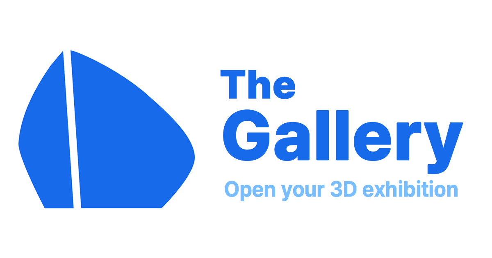

# Introduction

Welcome to our unique web Social Networking Service where photo sharing meets innovation. We've combined Three.js for captivating 3D exhibition spaces, Microservices Architecture (MSA) for a robust back-end, and Kubernetes for seamless serving.

# Demo Website

https://nekarak8s.github.io/gallery/

The page is served by mock service worker, so the request is not actually done.

# Design system

[Storybook Showcase](https://6581ad67bc8d05b6620ff016-kggifeviql.chromatic.com/?path=/docs/form-checkbox--docs)

Check the design system of the gallery.
